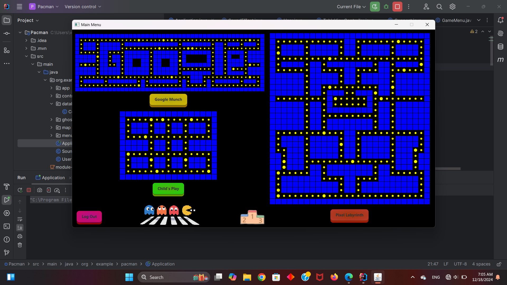

# Pacman

 

## Objectives
Here is a list of concepts which where used through out the project:
- Using OOP concepts
- Database design
- Designing graphical user interface with JavaFX

## Pre Requirements
- Java
- sqlite
- JavaFX
- IntelliJ as an IDE
- Maven as a build system for the project

## Creating GUI
The main tool for designing graphical user interface for this project is [JavaFX](..).

 

 